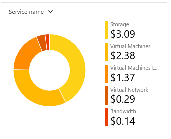

# Checkpoint6 Submission

- **COURSE INFORMATION: CAA900 - Capstone Project**
- **STUDENT’S NAME: Sanah Hussain Edavalath Vayalil Keloth**
- **STUDENT'S NUMBER: 160683231**
- **GITHUB USER ID: 160683231-myseneca**
- **TEACHER’S NAME: Atoosa Nasiri**

### Table of Contents

1. [Part A - Basic Connectivity - Linux VMs Firewall Setting](#part-a---basic-connectivity---linux-vms-firewall-setting)
2. [Part B - Azure Cost Analysis Charts](#part-b---azure-cost-analysis-charts)

## Part A - Basic Connectivity - Linux VMs Firewall Setting

1. Run a command in `LR-xx` that shows all `iptables` chains with their order number. What is the default setting? How could you improve these settings to be less vulnerable to attacks?

Command: `sudo iptables -nvL --line-numbers` 
Default setting usually includes a default policy of:
- `ACCEPT` all `state RELATED` packets
- `ACCEPT` all `icmp`
- `ACCEPT` all `ssh`
 
To improve the settings from vulnerabilities, we should allow `ssh` only from known CIDR ranges and reject `icmp`.   

2. Run a command that shows the hostname in `LR-XX` and `LS-XX` and embed the output in your submission.
  
- LR-45 hostname: `LR-45.CAA9002241.com`
- LS-45 hostname: `LS-45.CAA9002241.com`
  

3. Submit your `lr_iptables.txt` and `ls_iptables.txt` files.

LR iptables: [lr_iptables](./iptables/lr_iptables.txt) 
LS iptables: [ls_iptables](./iptables/ls_iptables.txt)
  

## Part B - Azure Cost Analysis Charts

1. Cost Analysis table

| No. | Scope | Chart Type | VIEW Type |  Date Range | Group By | Granularity| Chart |
|-|-|-|-|-|-|-|-|
|1|STUDENT-RG-1202091| Column (Stacked) | DailyCosts | Last 7 Days | Resource | Daily |  |
|2|STUDENT-RG-1202091| Column (Stacked) | DailyCosts | Last 7 Days | Service | Daily |  |
|3|STUDENT-RG-1202091| Area| AccumulatedCosts | Last 7 Days | Resource | Accumulated |  |
|4|STUDENT-RG-1202091| Pie Chart | NA | Last Month | Service Name | NA |  |
|5|STUDENT-RG-1202091| Pie Chart | NA | Last Month | Service Family | NA |  |
|6|STUDENT-RG-1202091| Pie Chart | NA | Last Month | Product | NA |  |

  

2. Customized Dashboard

