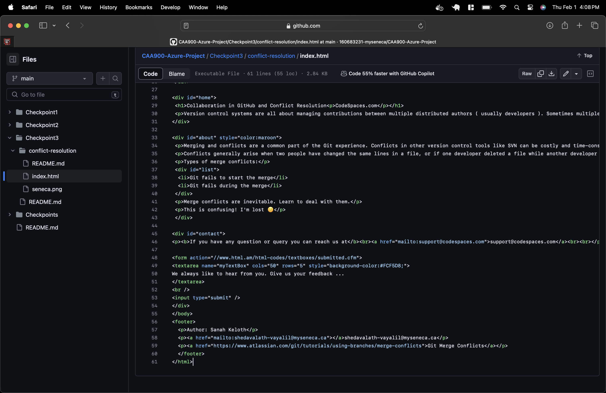
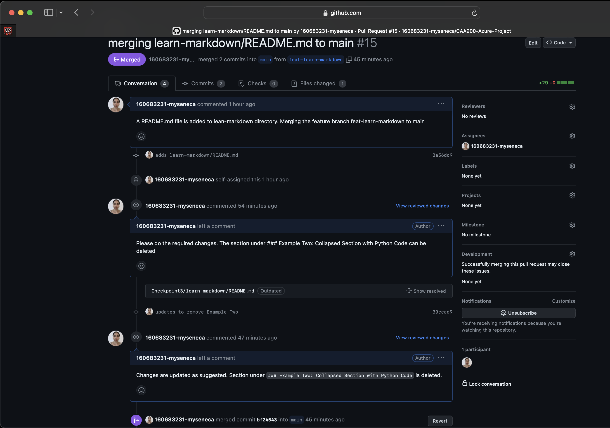

# Checkpoint3 Submission

- **COURSE INFORMATION: CAA900 - Capstone Project**
- **STUDENT’S NAME: Sanah Hussain Edavalath Vayalil Keloth**
- **STUDENT'S NUMBER: 160683231**
- **GITHUB USER ID: 160683231-myseneca**
- **TEACHER’S NAME: Atoosa Nasiri**

### Table of Contents
1. [Part A - Manage Conflicts - Overwrite Remote Changes](#part-a---manage-conflicts---overwrite-remote-changes)
2. [Part B - Manage Conflicts - Reset Local Commit Head](#part-b---manage-conflicts---reset-local-commit-head)
3. [Part C - Manage Conflicts - Merge Editor](#part-c---manage-conflicts---merge-editor)
4. [Part D - Collaboration - Creating Pull Request](#part-d---collaboration---creating-pull-request)

## Part A - Manage Conflicts - Overwrite Remote Changes
### Part 1 - Conflict Error Log
[conflict-error.log](./part1-conflict-error.log) :
```
Pushing to github.com:160683231-myseneca/CAA900-Azure-Project.git
To github.com:160683231-myseneca/CAA900-Azure-Project.git
 ! [rejected]        main -> main (fetch first)
error: failed to push some refs to 'github.com:160683231-myseneca/CAA900-Azure-Project.git'
hint: Updates were rejected because the remote contains work that you do
hint: not have locally. This is usually caused by another repository pushing
hint: to the same ref. You may want to first integrate the remote changes
hint: (e.g., 'git pull ...') before pushing again.
hint: See the 'Note about fast-forwards' in 'git push --help' for details.
```

### Part 1 - Conflict Overwrite Log
[conflict-overwrite.log](./part1-conflict-overwrite.log) :
```
Pushing to github.com:160683231-myseneca/CAA900-Azure-Project.git
To github.com:160683231-myseneca/CAA900-Azure-Project.git
 + cf1ea39...1cfcd57 main -> main (forced update)
updating local tracking ref 'refs/remotes/origin/main'
```

**Q) What is the color of the text after you forcefully overwrite remote with local changes?**
`green`

## Part B - Manage Conflicts - Reset Local Commit Head
### Part 2 - Conflict Error Log
[conflict-error.log](./part2-conflict-error.log) :
```
Pushing to github.com:160683231-myseneca/CAA900-Azure-Project.git
To github.com:160683231-myseneca/CAA900-Azure-Project.git
 ! [rejected]        main -> main (fetch first)
error: failed to push some refs to 'github.com:160683231-myseneca/CAA900-Azure-Project.git'
hint: Updates were rejected because the remote contains work that you do
hint: not have locally. This is usually caused by another repository pushing
hint: to the same ref. You may want to first integrate the remote changes
hint: (e.g., 'git pull ...') before pushing again.
hint: See the 'Note about fast-forwards' in 'git push --help' for details.
```

### Part 2 - Pull Error Log
[pull-error.log](./part2-pull-error.log) :
```
From github.com:160683231-myseneca/CAA900-Azure-Project
   1cfcd57..cbec61a  main       -> origin/main
Auto-merging Checkpoint3/conflict-resolution/index.html
CONFLICT (content): Merge conflict in Checkpoint3/conflict-resolution/index.html
Automatic merge failed; fix conflicts and then commit the result.
```

### Part 2 - Reset Head Log
[reset-head.log](./part2-reset-head.log) :
```
HEAD is now at 1cfcd57 modifies style color in index.html to green
commit 1cfcd579e6c58bf3d741afc0cb2d5c81daf957b5
Author: Sanah <shedavalath-vayalil@myseneca.ca>
Date:   Thu Feb 1 13:50:53 2024 -0500

    modifies style color in index.html to green
```

### Part 2 - Pull Success Log
[pull-success.log](./part2-pull-success.log) :
```
From github.com:160683231-myseneca/CAA900-Azure-Project
 = [up to date]      main       -> origin/main
Updating 1cfcd57..cbec61a
Fast-forward
 Checkpoint3/conflict-resolution/index.html | 2 +-
 1 file changed, 1 insertion(+), 1 deletion(-)
 ```

**Q) What is the color of the text after you forcefully overwrite remote with local changes?**
`maroon`

## Part C - Manage Conflicts - Merge Editor
### Part 3 - Pull Conflict Log
[pull-conflict.log](./part3-pull-conflict.log) :
```
From github.com:160683231-myseneca/CAA900-Azure-Project
 * branch            feat-body-text -> FETCH_HEAD
 * [new branch]      feat-body-text -> origin/feat-body-text
Auto-merging Checkpoint3/conflict-resolution/index.html
CONFLICT (content): Merge conflict in Checkpoint3/conflict-resolution/index.html
Automatic merge failed; fix conflicts and then commit the result.
```

### Part 3 - Status Log
[status.log](./part3-status.log) :
```
On branch main
Your branch is up to date with 'origin/main'.

All conflicts fixed but you are still merging.
  (use "git commit" to conclude merge)

Changes to be committed:
	modified:   conflict-resolution/index.html
```

**Final Result after Merge Resolution**



## Part D - Collaboration - Creating Pull Request

**Pull Request Summary**

