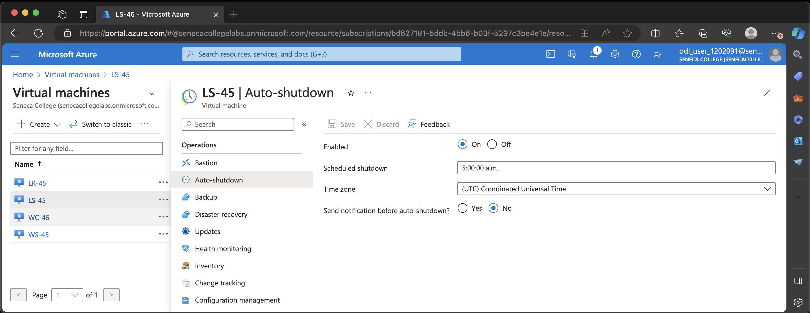
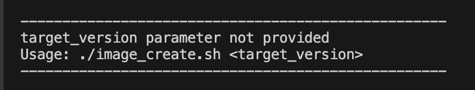

# Checkpoint4 Submission

- **COURSE INFORMATION: CAA900 - Capstone Project**
- **STUDENT’S NAME: Sanah Hussain Edavalath Vayalil Keloth**
- **STUDENT'S NUMBER: 160683231**
- **GITHUB USER ID: 160683231-myseneca**
- **TEACHER’S NAME: Atoosa Nasiri**

## Table of Contents

- [Part A - Creating Network Resources using Azure CLI](#part-a---creating-network-resources-using-azure-cli)
- [Part B - Working with Azure CLI Bash](#part-b---working-with-azure-cli-bash)
- [Part C - Network Review Questions](#part-c---network-review-questions)
- [Part D - Creating Virtual Machines using Azure CLI](#part-d---creating-virtual-machines-using-azure-cli)
- [Part E - Creating Custom Images from VMs using Azure CLI](#part-e---creating-custom-images-from-vms-using-azure-cli)
- [Part F - Clean Up your Environment using Azure CLI](#part-f---clean-up-your-environment-using-azure-cli)

## Part A - Creating Network Resources using Azure CLI

**Resource list :**

```
az resource list --resource-group Student-RG-1202091 --output table > partA_resource_list.tbl
```
[Link to partA_resource_list.tbl](./bash-scripts/partA_resource_list.tbl)

```
Name                  ResourceGroup       Location    Type                               Status
--------------------  ------------------  ----------  ---------------------------------  --------
RT-45                 Student-RG-1202091  canadaeast  Microsoft.Network/routeTables
Router-45             Student-RG-1202091  canadaeast  Microsoft.Network/virtualNetworks
Server-45             Student-RG-1202091  canadaeast  Microsoft.Network/virtualNetworks
Student-1202091-vnet  Student-RG-1202091  canadaeast  Microsoft.Network/virtualNetworks
odluser1202091        Student-RG-1202091  canadaeast  Microsoft.Storage/storageAccounts
```

1. In [network_config_test.sh](https://github.com/Azure-Project-Winter2024/Azure-Project-Scripts/tree/main/bash-scripts/network_config_test.sh) what does `if [[ ! $(az group list -o tsv --query "[?name=='$RG_NAME']") ]]` do? Explain your answer.

    The command `if [[ ! $(az group list -o tsv --query "[?name=='$RG_NAME']") ]]` checks if the resource group `$RG_NAME` does not exist using the `!` operator. If the conditional statement is met, then the tasks inside the `if` statement is carried out.

2. Why is it crucial to check if a resource exist before creating it? What bash syntax do you use to test this? How do you check if a `vnet` exists in [vnet_create.sh](https://github.com/Azure-Project-Winter2024/Azure-Project-Scripts/tree/main/bash-scripts/vnet_create.sh)?

    It is essential to check if a resource exists to avoid duplication errors and maintain idempotency. In bash, we can test if the resource exist using the syntax `if [[ $(az network vnet list -g $RG_NAME -o tsv --query "[?name=='$vnet']") ]]` which checks if any vnet with the name `$vbet` exists within the resource group `$RG_NAME`.

3. What is the Azure CLI command to create `vnet`? Give the specific command as per your environment and unique ID configuration. What are the required and what are the optional parameters that you need to pass to it?

    The command used to create vnet is `az network vnet create -g Student-RG-1202091 --name Router-45 --location canadaeast --address-prefix 192.168.45.0/24`. The required parameters include `-g` for resource group name and `--name` for the vnet name. The optional variables include `--location` to specify the location of the vnet and `--address-prefix` to specify the address range of the vnet to be created.. 

4. What is the Azure CLI command to create `subnet`? Give the specific command as per your environment and unique ID configuration. What are the required and what are the optional parameters that you need to pass to it?

    The command used to create subnet is `az network vnet subnet create --name SN1 -g Student-RG-1202091 --vnet-name Router-45 --address-prefix 192.168.45.32/27`. The required parameters include `-g` for resource group name, `--name` for the subnet name, and `--vnet-name` to specify the name of the vnet. The optional variables include `--address-prefix` to specify the address range of the subnet to be created. 

## Part B - Working with Azure CLI Bash

**Resource list :**

```
az resource list --resource-group Student-RG-1202091 --output table > partB_resource_list.tbl
```
[Link to partB_resource_list.tbl](./bash-scripts/partB_resource_list.tbl)

```
Name                  ResourceGroup       Location    Type                               Status
--------------------  ------------------  ----------  ---------------------------------  --------
RT-45                 Student-RG-1202091  canadaeast  Microsoft.Network/routeTables
Router-45             Student-RG-1202091  canadaeast  Microsoft.Network/virtualNetworks
Server-45             Student-RG-1202091  canadaeast  Microsoft.Network/virtualNetworks
Student-1202091-vnet  Student-RG-1202091  canadaeast  Microsoft.Network/virtualNetworks
odluser1202091        Student-RG-1202091  canadaeast  Microsoft.Storage/storageAccounts
```

1. List all VNETs using `az network vnet list` command and send the output in `json` format to `vnet_list.json`file

    ```
    az network vnet list --output json > vnet_list.json
    ```
        
    [Link to vnet_list.json](./bash-scripts/vnet_list.json)

2. Get the details of your `default student vnet` using `az show` command and send the output in `json` format to `student_vnet.json` file

    ```
    az network vnet show --name Student-1202091-vnet --resource-group Student-RG-1202091 --output json > student_vnet.json
    ```
        
    [Link to student_list.json](./bash-scripts/student_vnet.json)

3. List all peerings using `az network vnet peering list` command and send the output in `table` format to `peerings.tbl`file

    ```
    az network vnet peering list --resource-group Student-RG-1202091 --vnet-name Router-45 --output table >> peerings.tbl
    az network vnet peering list --resource-group Student-RG-1202091 --vnet-name Server-45 --output table >> peerings.tbl
    az network vnet peering list --resource-group Student-RG-1202091 --vnet-name Student-1202091-vnet --output table >> peerings.tbl
    ```
    [Link to peerings.tbl](./bash-scripts/peerings.tbl)
    ```
    AllowForwardedTraffic    AllowGatewayTransit    AllowVirtualNetworkAccess    DoNotVerifyRemoteGateways    Name             PeeringState    PeeringSyncLevel    ProvisioningState    ResourceGroup       ResourceGuid                          UseRemoteGateways
    -----------------------  ---------------------  ---------------------------  ---------------------------  ---------------  --------------  ------------------  -------------------  ------------------  ------------------------------------  -------------------
    True                     False                  True                         False                        RoutertoStudent  Connected       FullyInSync         Succeeded            Student-RG-1202091  53dbddff-8f0c-0687-0d32-ab544de715b2  False
    True                     False                  True                         False                        RoutertoServer   Connected       FullyInSync         Succeeded            Student-RG-1202091  aca764cc-72b8-07f7-2221-cfa8598c9827  False

    AllowForwardedTraffic    AllowGatewayTransit    AllowVirtualNetworkAccess    DoNotVerifyRemoteGateways    Name            PeeringState    PeeringSyncLevel    ProvisioningState    ResourceGroup       ResourceGuid                          UseRemoteGateways
    -----------------------  ---------------------  ---------------------------  ---------------------------  --------------  --------------  ------------------  -------------------  ------------------  ------------------------------------  -------------------
    True                     False                  True                         False                        ServertoRouter  Connected       FullyInSync         Succeeded            Student-RG-1202091  aca764cc-72b8-07f7-2221-cfa8598c9827  False

    AllowForwardedTraffic    AllowGatewayTransit    AllowVirtualNetworkAccess    DoNotVerifyRemoteGateways    Name                    PeeringState    PeeringSyncLevel    ProvisioningState    ResourceGroup       ResourceGuid                          UseRemoteGateways
    -----------------------  ---------------------  ---------------------------  ---------------------------  ----------------------  --------------  ------------------  -------------------  ------------------  ------------------------------------  -------------------
    True                     False                  True                         False                        Student-Bastion1202091  Initiated       RemoteNotInSync     Succeeded            Student-RG-1202091  90cd61dc-0466-0362-34bf-f58eb5bac82a  False
    True                     False                  True                         False                        StudenttoRouter         Connected       FullyInSync         Succeeded            Student-RG-1202091  53dbddff-8f0c-0687-0d32-ab544de715b2  False
    ```

4. Get the details of your `Router-XX` subnet `SN1` using `az show` command in `json` format and `query` it for details of subnet and rout associations. Only submit the specific property you are asked for. You will need to embed this in your `README.md` as per instructions.

    ```
    az network vnet subnet show --name SN1 --vnet-name Router-45 --resource-group Student-RG-1202091 --query "{Subnet: name, RouteAssociation: routeTable.id}" > router-45_details.json
    ```
        
    [Link to router-45_details.json](./bash-scripts/router-45_details.json)

    ```
    {
    "RouteAssociation": null,
    "Subnet": "SN1"
    }
    ```
5. List all routes in `RT-xx` using `az network route-table route list` command and send the output in `table` format to `route_list.tbl`file

    ```
    az network route-table route list --resource-group Student-RG-1202091 --route-table-name RT-45 --output table > route_list.tbl
    ```
        
    [Link to route_list.tbl](./bash-scripts/route_list.tbl)

    ```
    AddressPrefix    HasBgpOverride    Name              NextHopIpAddress    NextHopType       ProvisioningState    ResourceGroup
    ---------------  ----------------  ----------------  ------------------  ----------------  -------------------  ------------------
    172.17.45.32/27  False             Route-to-Server   192.168.45.36       VirtualAppliance  Succeeded            Student-RG-1202091
    10.3.65.0/24     False             Route-to-Desktop  192.168.45.36       VirtualAppliance  Succeeded            Student-RG-1202091
    ```
    
6. Get the details of route between your `Router-xx SN1` and `Server-xx SN` using `az network route-table route show` and send the output in `json` format to `route_details.json`

    ```
    az network route-table route show --resource-group Student-RG-1202091 --route-table-name RT-45 --name Route-to-Server --output json > route_details.json
    ```
        
    [Link to route_details.json](./bash-scripts/route_details.json)

7. (Optional) What CLI command will show you which subnet is associated to which route in route table? _(Hint: maybe start with 'az network vnet subnet show`)_

## Part C - Network Review Questions

1. What is Azure Virtual Network (VNET)? Elaborate in your own words, you may use diagrams if drawn by yourself.

    Azure VNets are the building blocks for a network with address spaces or CIDR blocks. It allows for seamless and secure communication between resources within the network, with internet or other networks including on-prem networks. We can create subnets to segment the vnet address space to fine tune allocation of address space. 

2. In the context of Hybrid Cloud architecture. How on-prem computers can access resources inside Azure virtual network?

    On-Prem computers can access azure Vnets by establising site-to-site VPN using VPN gateways or ExpressRoute. While the former uses an encrypted connection over public internet, the later establishes a dedicated private connection over azure's private network.

3. What are the most important benefits of Azure Virtual Networks? Elaborate in your own words. Do not copy/paste from Azure Documentation. Itemized list of just benefit without proper elaboration will not receive any marks

    - Segmentation and Isolation: vnets along with subnets help to segment address spaces that help to seperate networks where the resources reside and also help to control the traffic between the resources. 
    - Network control and Security: it can fine tune controls like IP address assignment, rules for routing traffic, network security policies amongst others to help control network traffic and to inherent enhance network security.
    - Scalability: it is easy to scale the vnets on azure cloud as and when required. It is possible to resizr vnets without any downtime. 
    - Connectivity: It is easy to connect resources within vnets be it with other vnets (peering or transit gateway) or with on-prem vnets (vpn or expressroute). 

4. What is the difference between Network Security Group (NSG) and Route-Tables?

    NSGs are a list of security rules that are used to allow or deny network traffic. They are usually associated with subnets, NICs or VMs. On the other hand, route tables are used to specify how network traffic are routed to and fro from vnets or within vnets. It routes the traffic using next hop, the ip address of the next network device that where the traffic will be initially directed to, from where it will be forwarded to the destination ip address.

5. What is the difference between NSG and Firewalls?

    While both of them are concered with security of the network, NSGs are list of simple rules that help filter traffic based on source ip, destination ip, port number and network protocol. On the other hand, Firewalls are more complex stateful security solutions that filters traffic based on application or service level filtering rules. While the former operates on layers 3 and 4 (network and transport), the later operates on layers 4 and 7 (transport and application). 

6. What is a _hob-and-spoke_ network topology and how be deployed in Azure Cloud?

    The hub and spoke network is consists of the central hub vnet connected to multiple other vnets called spoke. It is usually used to implement centralised management of network traffic, security policies and services.

7. In working with Azure VNETs, do you need o to define gateways for Azure to route traffic between subnets?

    There is no need for gateways to route traffic between subnets within the same vnets. This is because azure automatically handles the traffic between subnets and are routed through its internal infrastructure.

8. When do you need to configure and use Virtual Network Gateways?

    Azure VPN gateways are required to connect 
    - VNet to VNet VPN Connection: between azure vnet to other azure vnets, especially in the case of connecting vnets across mulpliple regions
    - Site to Site VPN Connection: between azure vnet to on prem vnets, as in the case of hybrid cloud
    - Point to Site VPN Connection: between azure vnet and individual VPN client devices like computer or mobiles devices

## Part D - Creating Virtual Machines using Azure CLI

Windows VM Credentials in [backend_config.sh](./bash-scripts/backend_config.sh)

```
# Windows VM Credentials
USER_NAME="student"
ADMIN_PW="adminPW12345"
```
**Resource list :**

```
az resource list --resource-group Student-RG-1202091 --output table > partD_resource_list.tbl
```
[Link to partD_resource_list.tbl](./bash-scripts/partD_resource_list.tbl)

```
Name                                             ResourceGroup       Location    Type                                     Status
-----------------------------------------------  ------------------  ----------  ---------------------------------------  --------
LR-45_OsDisk_1_beab9782b3e848a2b5354458152d923a  STUDENT-RG-1202091  canadaeast  Microsoft.Compute/disks
LS-45_OsDisk_1_921976e4293c43f7b6d189b4ac31a60c  STUDENT-RG-1202091  canadaeast  Microsoft.Compute/disks
WC-45_OsDisk_1_a95404e9363f4f1da0440d36227e4f75  STUDENT-RG-1202091  canadaeast  Microsoft.Compute/disks
WS-45_OsDisk_1_be49ad379baf41efacb0e9abdd937860  STUDENT-RG-1202091  canadaeast  Microsoft.Compute/disks
sshkey                                           Student-RG-1202091  canadaeast  Microsoft.Compute/sshPublicKeys
LR-45                                            Student-RG-1202091  canadaeast  Microsoft.Compute/virtualMachines
LS-45                                            Student-RG-1202091  canadaeast  Microsoft.Compute/virtualMachines
WC-45                                            Student-RG-1202091  canadaeast  Microsoft.Compute/virtualMachines
WS-45                                            Student-RG-1202091  canadaeast  Microsoft.Compute/virtualMachines
shutdown-computevm-LR-45                         Student-RG-1202091  canadaeast  Microsoft.DevTestLab/schedules
shutdown-computevm-LS-45                         Student-RG-1202091  canadaeast  Microsoft.DevTestLab/schedules
shutdown-computevm-WC-45                         Student-RG-1202091  canadaeast  Microsoft.DevTestLab/schedules
shutdown-computevm-WS-45                         Student-RG-1202091  canadaeast  Microsoft.DevTestLab/schedules
lr-45                                            Student-RG-1202091  canadaeast  Microsoft.Network/networkInterfaces
ls-45                                            Student-RG-1202091  canadaeast  Microsoft.Network/networkInterfaces
wc-45                                            Student-RG-1202091  canadaeast  Microsoft.Network/networkInterfaces
ws-45                                            Student-RG-1202091  canadaeast  Microsoft.Network/networkInterfaces
LR-NSG-45                                        Student-RG-1202091  canadaeast  Microsoft.Network/networkSecurityGroups
LS-NSG-45                                        Student-RG-1202091  canadaeast  Microsoft.Network/networkSecurityGroups
WC-NSG-45                                        Student-RG-1202091  canadaeast  Microsoft.Network/networkSecurityGroups
WS-NSG-45                                        Student-RG-1202091  canadaeast  Microsoft.Network/networkSecurityGroups
RT-45                                            Student-RG-1202091  canadaeast  Microsoft.Network/routeTables
Router-45                                        Student-RG-1202091  canadaeast  Microsoft.Network/virtualNetworks
Server-45                                        Student-RG-1202091  canadaeast  Microsoft.Network/virtualNetworks
Student-1202091-vnet                             Student-RG-1202091  canadaeast  Microsoft.Network/virtualNetworks
odluser1202091                                   Student-RG-1202091  canadaeast  Microsoft.Storage/storageAccounts
```

1. List all VMs and send the output in `table` format to `vm_list.tbl` file. What command did you use?

    ```
    az vm list --output table > vm_list.tbl
    ```
        
    [Link to vm_list.tbl](./bash-scripts/vm_list.tbl)

    ```
    Name    ResourceGroup       Location    Zones
    ------  ------------------  ----------  -------
    LR-45   STUDENT-RG-1202091  canadaeast
    LS-45   STUDENT-RG-1202091  canadaeast
    WC-45   STUDENT-RG-1202091  canadaeast
    WS-45   STUDENT-RG-1202091  canadaeast
    ```

2. Get the details of your `WC-XX` using `az show` command and send the output in `json` format to `WC-XX-details.json` file. What command did you use?

    ```
    az vm show --name WC-45 --resource-group STUDENT-RG-1202091 -o json > WC-45-details.json
    ```
        
    [Link to WC-45-details.json](./bash-scripts/WC-45-details.json)

3. List all NSG using `az list` command and send the output in `table` format to `nsg_list.tbl`file. What command did you use?

    ```
    az network nsg list --output table > nsg_list.tbl
    ```
        
    [Link to nsg_list.tbl](./bash-scripts/nsg_list.tbl)

    ```
    Location    Name       ProvisioningState    ResourceGroup       ResourceGuid
    ----------  ---------  -------------------  ------------------  ------------------------------------
    canadaeast  LR-NSG-45  Succeeded            Student-RG-1202091  41815072-aea7-421f-a318-8a3d47c79ddc
    canadaeast  LS-NSG-45  Succeeded            Student-RG-1202091  75a39667-70b1-4452-a3b9-80ebad2f8b9a
    canadaeast  WC-NSG-45  Succeeded            Student-RG-1202091  b50932d7-92a1-4de8-83b1-ff9b387bc396
    canadaeast  WS-NSG-45  Succeeded            Student-RG-1202091  10e70a7e-6eae-447d-80be-d9a9d97f279a
    ```

4. Provide screenshot of _auto shutdown configuration_ for `LS_XX`. Is there any command to show this? What is the time-zone? What should be the correct time settings considering the time zone differences?

    There are no bash commands to show auto shutdown configuration and the portal must be used in this case. The time zone shown is UTC (Coordinated Universal Time). However, the time zone used to configure the schedule is the time zone of the deployed resources by default, which is then stored by azure in UTC format by default. There is no need to correct the time settings. UTC 5.00 am is 12.00 am ET, but the time zone itself can be changed on the portal for convenience. 

 "LS-45 Auto Shutdown screenshot"

5. Why `auto shutdown configuration` is not done in [vm_create](https://github.com/Azure-Project-Winter2024/Azure-Project-Scripts/blob/94d21ad5454163ae8e2ee331f8a41291fca6e155/CP4-Scripts/bash-scripts/vm_create.sh#L128) code? Why is it a separate scripts? Is it possible to configure auto shutdown at the same time you are creating the VM?

    Auto shutdown configuration is used in a seperate script for better manageability, but as in the case of `custom_vm_create.sh` script, it can be added to the same script. While it is indeed possible to configure auto shutdown while creating vm in the portal (under management portal), there is no option to set the variables to specify the autoshutdown using azure-cli while using `az vm create` command and is instead a seperate command `az vm auto-shutdown`. 

## Part E - Creating Custom Images from VMs using Azure CLI

**Resource list :**

```
az resource list --resource-group Student-RG-1202091 --output table > partE_resource_list.tbl
```
[Link to partE_resource_list.tbl](./bash-scripts/partE_resource_list.tbl)

```
Name                                          ResourceGroup       Location    Type                                     Status
--------------------------------------------  ------------------  ----------  ---------------------------------------  --------
LR-45_disk1_f224665fec314ab58eaefc8144f48ea9  STUDENT-RG-1202091  canadaeast  Microsoft.Compute/disks
LS-45_disk1_3185714ea4de42178bf3bc304a2298c3  STUDENT-RG-1202091  canadaeast  Microsoft.Compute/disks
WC-45_disk1_9dabcd05d4c54bb99425738144d26d9e  STUDENT-RG-1202091  canadaeast  Microsoft.Compute/disks
WS-45_disk1_c9be44b6889e4758b4b11677193301b0  STUDENT-RG-1202091  canadaeast  Microsoft.Compute/disks
lr-45-ver-1.0                                 Student-RG-1202091  canadaeast  Microsoft.Compute/images
ls-45-ver-1.0                                 Student-RG-1202091  canadaeast  Microsoft.Compute/images
wc-45-ver-1.0                                 Student-RG-1202091  canadaeast  Microsoft.Compute/images
ws-45-ver-1.0                                 Student-RG-1202091  canadaeast  Microsoft.Compute/images
sshkey                                        Student-RG-1202091  canadaeast  Microsoft.Compute/sshPublicKeys
LR-45                                         Student-RG-1202091  canadaeast  Microsoft.Compute/virtualMachines
LS-45                                         Student-RG-1202091  canadaeast  Microsoft.Compute/virtualMachines
WC-45                                         Student-RG-1202091  canadaeast  Microsoft.Compute/virtualMachines
WS-45                                         Student-RG-1202091  canadaeast  Microsoft.Compute/virtualMachines
shutdown-computevm-LR-45                      Student-RG-1202091  canadaeast  Microsoft.DevTestLab/schedules
shutdown-computevm-LS-45                      Student-RG-1202091  canadaeast  Microsoft.DevTestLab/schedules
shutdown-computevm-WC-45                      Student-RG-1202091  canadaeast  Microsoft.DevTestLab/schedules
shutdown-computevm-WS-45                      Student-RG-1202091  canadaeast  Microsoft.DevTestLab/schedules
lr-45                                         Student-RG-1202091  canadaeast  Microsoft.Network/networkInterfaces
ls-45                                         Student-RG-1202091  canadaeast  Microsoft.Network/networkInterfaces
wc-45                                         Student-RG-1202091  canadaeast  Microsoft.Network/networkInterfaces
ws-45                                         Student-RG-1202091  canadaeast  Microsoft.Network/networkInterfaces
LR-NSG-45                                     Student-RG-1202091  canadaeast  Microsoft.Network/networkSecurityGroups
LS-NSG-45                                     Student-RG-1202091  canadaeast  Microsoft.Network/networkSecurityGroups
WC-NSG-45                                     Student-RG-1202091  canadaeast  Microsoft.Network/networkSecurityGroups
WS-NSG-45                                     Student-RG-1202091  canadaeast  Microsoft.Network/networkSecurityGroups
RT-45                                         Student-RG-1202091  canadaeast  Microsoft.Network/routeTables
Router-45                                     Student-RG-1202091  canadaeast  Microsoft.Network/virtualNetworks
Server-45                                     Student-RG-1202091  canadaeast  Microsoft.Network/virtualNetworks
Student-1202091-vnet                          Student-RG-1202091  canadaeast  Microsoft.Network/virtualNetworks
odluser1202091                                Student-RG-1202091  canadaeast  Microsoft.Storage/storageAccounts
```

1. What are the difference between the script that creates VM from Azure Generic Image vs Custom Image? A good place to start is to compare the two scripts `vm_create.sh` and `custom_vm_create.sh` and check the parameters passed to `az vm create` command. Elaborate the differences you observe.

`vm_create.sh` uses publicly available stock images to create a vm. On the other hand, `custom_vm_create.sh` uses a custom image created by capturing the configuration of a deployed vm. Moreover, we have to pass the variable to set `target-version` in the later, which helps to identify the custom `image_name` version to be used for vm creation. This helps in quick and consistent deployment of vms. 

2. If you run `custom_vm_create.sh` without custom image `version` number, the script will throw an error and show you the usage suggestion. What is the usage suggestion?

    Te error message is suggesting that the parameter `target-version` of the image should be supplied for the script to run successfully.

 "Error message while creating vm using custom_vm_create.sh without image version"

3. The script is purposefully written such that it waits on each custom image creation to be completed before proceeding to next image. Can you update the script such that custom images creation runs in background, i.e. how can you parallelize the process?_Hint: only provide the single line command that you need to update_

    The process can be run parallelly by adding the argument `--no-wait` to the `az image create` command. This allows the command to run in the background and the script to proceed to next command.

4. Once all custom images are successfully created, run a command in CLI that lists all your Custom Images. Change the output format to table format and embed the answer in your submission.

    ```
    az image list --resource-group Student-RG-1202091 --output table > image_list.tbl
    ```
        
    [Link to image_list.tbl](./bash-scripts/image_list.tbl)

    ```
    HyperVGeneration    Location    Name           ProvisioningState    ResourceGroup
    ------------------  ----------  -------------  -------------------  ------------------
    V2                  canadaeast  lr-45-ver-1.0  Succeeded            Student-RG-1202091
    V2                  canadaeast  ls-45-ver-1.0  Succeeded            Student-RG-1202091
    V2                  canadaeast  wc-45-ver-1.0  Succeeded            Student-RG-1202091
    V1                  canadaeast  ws-45-ver-1.0  Succeeded            Student-RG-1202091
    ```   

5. Get a list of your VM, NSG, NIC, Disks, and Custom Iamges using Azure CLI in table format. Which ones are empty? 

    None of them are empty because we redeployed the vms using custom images.

- **VM List**

    ```
    az vm list --resource-group Student-RG-1202091 --output table > custom_vm_list.tbl
    ```
        
    [Link to custom_vm_list.tbl](./bash-scripts/custom_vm_list.tbl)

    ```
    Name    ResourceGroup       Location    Zones
    ------  ------------------  ----------  -------
    LR-45   Student-RG-1202091  canadaeast
    LS-45   Student-RG-1202091  canadaeast
    WC-45   Student-RG-1202091  canadaeast
    WS-45   Student-RG-1202091  canadaeast
    ```

- **NSG List**

    ```
    az network nsg list --resource-group Student-RG-1202091 --output table > nsg_lists.tbl
    ```
        
    [Link to nsg_lists.tbl](./bash-scripts/nsg_lists.tbl)

    ```
    Location    Name       ProvisioningState    ResourceGroup       ResourceGuid
    ----------  ---------  -------------------  ------------------  ------------------------------------
    canadaeast  LR-NSG-45  Succeeded            Student-RG-1202091  71378a96-5935-4385-a1aa-9f9a408b223c
    canadaeast  LS-NSG-45  Succeeded            Student-RG-1202091  f1ae0a96-625a-46cd-b995-4bf88dd0f5bc
    canadaeast  WC-NSG-45  Succeeded            Student-RG-1202091  780bb7eb-0433-4d98-99d9-935000c95b9c
    canadaeast  WS-NSG-45  Succeeded            Student-RG-1202091  f5535853-4c43-44ef-8b2c-0ab9696983bd
    ```

- **NIC List**

    ```
    az network nic list --resource-group Student-RG-1202091 --output table > nic_list.tbl
    ```
        
    [Link to nic_list.tbl](./bash-scripts/nic_list.tbl)

    ```
    AuxiliaryMode    AuxiliarySku    DisableTcpStateTracking    EnableAcceleratedNetworking    EnableIPForwarding    Location    MacAddress         Name    NicType    Primary    ProvisioningState    ResourceGroup       ResourceGuid                          VnetEncryptionSupported
    ---------------  --------------  -------------------------  -----------------------------  --------------------  ----------  -----------------  ------  ---------  ---------  -------------------  ------------------  ------------------------------------  -------------------------
    None             None            False                      False                          False                 canadaeast  7C-1E-52-06-44-2D  lr-45   Standard   True       Succeeded            Student-RG-1202091  76296640-5623-4fe1-91fe-6213b073bc7d  False
    None             None            False                      False                          False                 canadaeast  60-45-BD-F9-CC-E4  ls-45   Standard   True       Succeeded            Student-RG-1202091  330623fc-bd49-44c1-a3be-c88276f4e699  False
    None             None            False                      False                          False                 canadaeast  60-45-BD-F9-CE-4D  wc-45   Standard   True       Succeeded            Student-RG-1202091  4598a2fc-16f6-4dab-8043-5626b6079e14  False
    None             None            False                      False                          False                 canadaeast  60-45-BD-F9-A7-F3  ws-45   Standard   True       Succeeded            Student-RG-1202091  4e715ea3-067a-48c1-8154-ab52be047fab  False
    ```

- **OS DISK List**

    ```
    az disk list --resource-group Student-RG-1202091 --output table > disk_list.tbl
    ```
        
    [Link to disk_list.tbl](./bash-scripts/disk_list.tbl)

    ```
    Name                                          ResourceGroup       Location    Zones    Sku              OsType    SizeGb    ProvisioningState
    --------------------------------------------  ------------------  ----------  -------  ---------------  --------  --------  -------------------
    LR-45_disk1_89ed54e56dd747c4ae727477d53e7967  Student-RG-1202091  canadaeast           StandardSSD_LRS  Linux     64        Succeeded
    LS-45_disk1_318df4e16e9645cfb1707acf7963fbaf  Student-RG-1202091  canadaeast           StandardSSD_LRS  Linux     64        Succeeded
    WC-45_disk1_1a6196c406564b5ebdb33996e6fd37a1  Student-RG-1202091  canadaeast           StandardSSD_LRS  Windows   127       Succeeded
    WS-45_disk1_b967f9ef1f74430192c7ac74e740f18c  Student-RG-1202091  canadaeast           StandardSSD_LRS  Windows   127       Succeeded
    ```

- **Custom Image List**

    ```
    az image list --resource-group Student-RG-1202091 --output table > image_list.tbl
    ```
        
    [Link to image_list.tbl](./bash-scripts/image_list.tbl)

    ```
    HyperVGeneration    Location    Name           ProvisioningState    ResourceGroup
    ------------------  ----------  -------------  -------------------  ------------------
    V2                  canadaeast  lr-45-ver-1.0  Succeeded            Student-RG-1202091
    V2                  canadaeast  ls-45-ver-1.0  Succeeded            Student-RG-1202091
    V2                  canadaeast  wc-45-ver-1.0  Succeeded            Student-RG-1202091
    V1                  canadaeast  ws-45-ver-1.0  Succeeded            Student-RG-1202091
    ```

## Part F - Clean Up your Environment using Azure CLI

1. After deleting list all your VMs using `az  vm list ...` with the output in `table` format. What command did you use? How can you ensure all your VMs are deleted?

    Running `az vm list --resource-group Student-RG-1202091 --output table` 

2. Why you are not asked to delete Custom Images? What is the difference between VM and Custom Image that makes VM a very costly resource and Custom Images, negligible? (_Hint: It is related to OS Disk_)

    Vm incur consume compute resources, like OS Disk, CPU, RAM, etc. to run and are thus costly. In contrast, images only incur only storage cost, which are marginal when compared to running a vm. Images require vm to be running, in order to create image template from them. This process is time and resource intensive when compared to storing images. 

3. What are cost implications of NSG or NIC? Why are you deleting them?

    NSG and NIC have negligible cost on their own. But since they are tied up to VMs, it is best practice to delete them as a part of cleanup process as they are not being used.

4. Why you are not deleting Network backend like VNET and Route-Tables?

    These resources do not incur any cost and can be reused for redeployment.