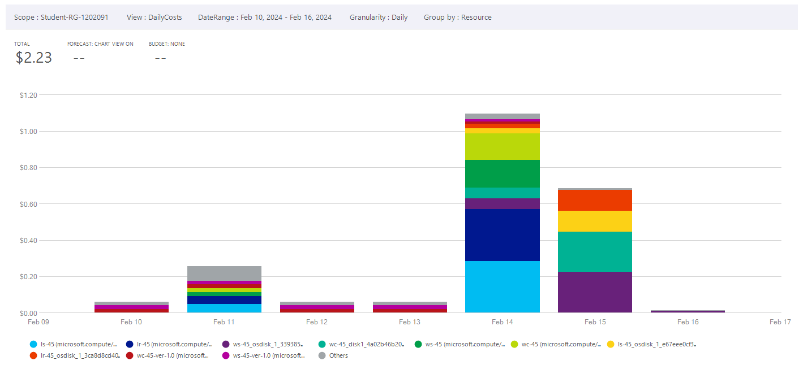
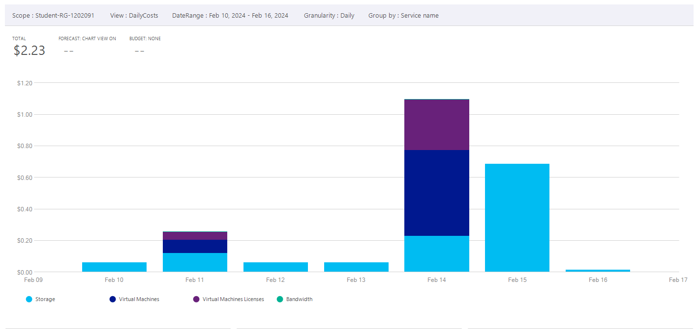
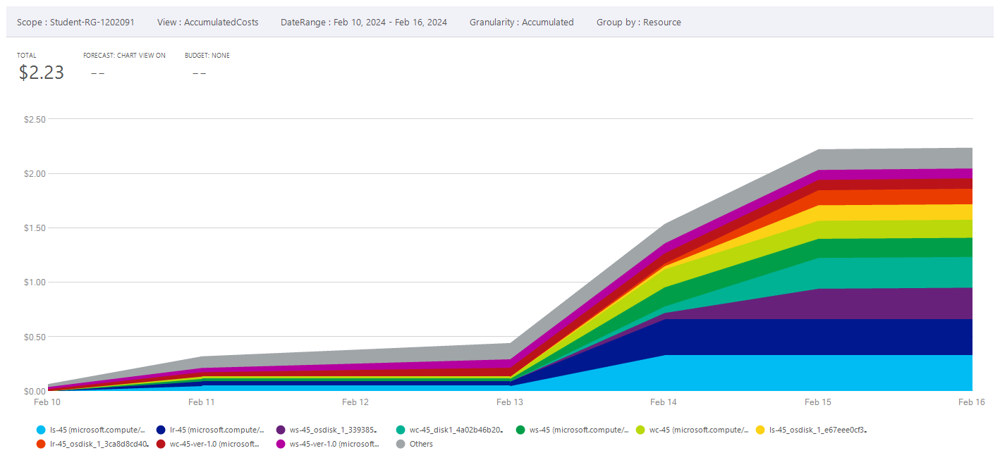
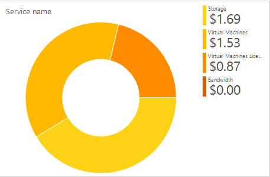
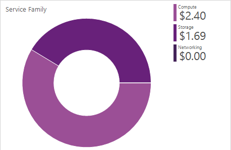
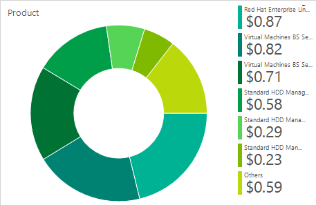
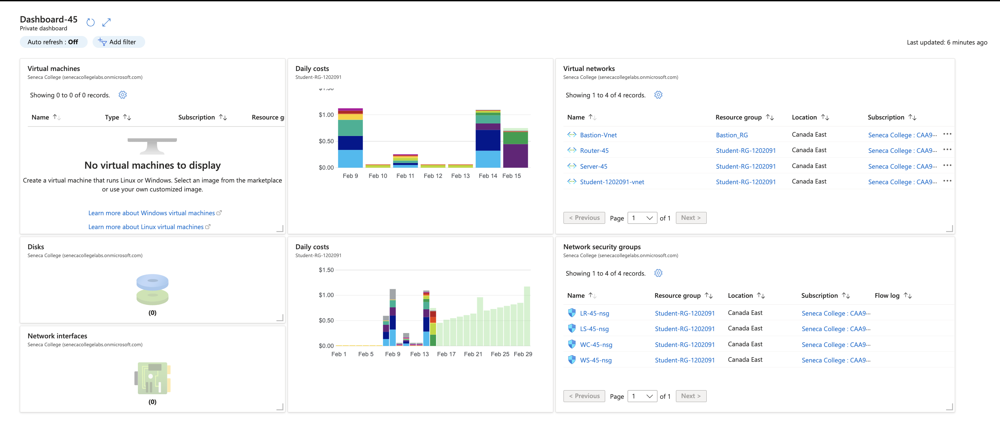

# Checkpoint5 Submission

- **COURSE INFORMATION: CAA900 - Capstone Project**
- **STUDENT’S NAME: Sanah Hussain Edavalath Vayalil Keloth**
- **STUDENT'S NUMBER: 160683231**
- **GITHUB USER ID: 160683231-myseneca**
- **TEACHER’S NAME: Atoosa Nasiri**

### Table of Contents

1. [Part A - Creating & Configuring VMs - Using Portal](#part-a---creating--configuring-vms---using-portal)
2. [Part B - Basic Connectivity - VM Configuration](#part-b---basic-connectivity---vm-configuration)
3. [Part C - Enable IP_Forwarding - Using Portal](#part-c---enable-ip_forwarding---using-portal)
4. [Part D - Creating & Configuring VM Images - Using Portal](#part-d---creating--configuring-vm-images---using-portal)
5. [Part E - Azure Cost Analysis Charts](#part-e---azure-cost-analysis-charts)
6. [Part F - Create Customized Azure Dashboard](#part-f---create-customized-azure-dashboard)

## Part A - Creating & Configuring VMs - Using Portal

1. What is the difference between Windows machine NSG and Linux machine NSG rules? Why? **Do not give screenshots** just describe the difference? Do you need a rule for `ssh` or `rdp`? What happens if you delete specific `ssh` and `rdp` rules?
The difference between windows nsg and linux nsg lies in the protocol used to access the machine. While windows uses RDP (Remote Desktop Protocol) on port 3389, Linux uses SSH (Secure Shell Hashing) on port 22. Yes, you need a nsg rule for RDP in windows and ssh for linux for connecting to the machines remotely. In these rules are deleted, it would be not be possible to remotely connect the respective machines as the access through rdp and ssh protocols will be blocked. 

2. Work from Azure Bash CLI in **Portal** to get a list of your VM, NSG, NIC, and Disks. 

# Resource Group list
`az group list -o table`
```
Name                Location    Status
------------------  ----------  ---------
Bastion_RG          canadaeast  Succeeded
NetworkWatcherRG    canadaeast  Succeeded
Student-RG-1202091  canadaeast  Succeeded
```
# Create variable

`RG="Student-RG-1202091"`

# List of VMs

`az vm list -g $RG -o table`
```
Name    ResourceGroup       Location    Zones
------  ------------------  ----------  -------
LR-45   Student-RG-1202091  canadaeast
LS-45   Student-RG-1202091  canadaeast
WC-45   Student-RG-1202091  canadaeast
WS-45   Student-RG-1202091  canadaeast
```

# List of NSGs

`az network nsg list -g $RG -o table`
```
Location    Name       ProvisioningState    ResourceGroup       ResourceGuid
----------  ---------  -------------------  ------------------  ------------------------------------
canadaeast  LR-45-nsg  Succeeded            Student-RG-1202091  cc778bab-c3ab-4fe8-a0b0-4da834e03dff
canadaeast  LS-45-nsg  Succeeded            Student-RG-1202091  e85b254b-ad6e-4181-b95c-206a47a7c5dc
canadaeast  WC-45-nsg  Succeeded            Student-RG-1202091  95570f1f-f32f-41f0-8ac3-42ebc0c3120c
canadaeast  WS-45-nsg  Succeeded            Student-RG-1202091  dafacb9a-8c49-48f7-9c39-1ae5b64faf96
```

# List of NICs

`az network nic list -g $RG -o table`
```
AuxiliaryMode    AuxiliarySku    DisableTcpStateTracking    EnableAcceleratedNetworking    EnableIPForwarding    Location    MacAddress         Name      NicType    Primary    ProvisioningState    ResourceGroup       ResourceGuid                          VnetEncryptionSupported
---------------  --------------  -------------------------  -----------------------------  --------------------  ----------  -----------------  --------  ---------  ---------  -------------------  ------------------  ------------------------------------  -------------------------
None             None            False                      False                          False                 canadaeast  00-0D-3A-F4-74-61  lr-45212  Standard   True       Succeeded            Student-RG-1202091  73519d4c-93dc-44d9-805b-6ec55f51418a  False
None             None            False                      False                          False                 canadaeast  00-0D-3A-F4-DF-F4  ls-45582  Standard   True       Succeeded            Student-RG-1202091  8b8bc043-f793-464b-8ceb-74d5ac3fadbc  False
None             None            False                      False                          False                 canadaeast  00-22-48-6E-17-02  wc-45852  Standard   True       Succeeded            Student-RG-1202091  f12f6e56-8f19-4929-ad67-0a85d50c5a14  False
None             None            False                      False                          False                 canadaeast  60-45-BD-F9-AE-91  ws-457    Standard   True       Succeeded            Student-RG-1202091  c5ddb9d4-c64e-4031-8346-a9f6ac802640  False
```

# List of OsDisks

`az disk list -g $RG -o table`
```
Name                                             ResourceGroup       Location    Zones    Sku           OsType    SizeGb    ProvisioningState
-----------------------------------------------  ------------------  ----------  -------  ------------  --------  --------  -------------------
LR-45_OsDisk_1_3ca8d8cd40004bc382545c69f69825a4  Student-RG-1202091  canadaeast           Standard_LRS  Linux     64        Succeeded
LS-45_OsDisk_1_e67eee0cf3894efdbd184681fc85211c  Student-RG-1202091  canadaeast           Standard_LRS  Linux     64        Succeeded
WC-45_disk1_4a02b46b20ab484c9f88e360adecacf3     Student-RG-1202091  canadaeast           Standard_LRS  Windows   127       Succeeded
WS-45_OsDisk_1_339385eca1e14170aee7d2238d7fe83b  Student-RG-1202091  canadaeast           Standard_LRS  Windows   127       Succeeded
```

## Part B - Basic Connectivity - VM Configuration

1. Check the status of ip-forwarding using the command `az network nic ip-config show` with output format as `json`. 

`az network nic ip-config show --output json`

It is not possible to check the IP forwarding status from the above command because IP forwarding is set at the NIC level and not at the ip-config level

2. When your output format is `json`

`enableIPForwarding`

3. Check if the IP forwarding in NIC is enabled using Azure bash.

`az network nic show -g $RG -n lr-45212 --query "enableIPForwarding"`
```
true
```

## Part C - Enable IP_Forwarding - Using Portal

1. In configuring your Linux VMs, for the step "Remove the `firewalld` service", which command will you be using?

```
sudo systemctl stop firewalld
sudo systemctl disable firewalld
```

2. In configuring your Linux VMs, what command do you use to check the status of `iptabels`?

`sudo systemctl status iptables`

3. How can you make iptables service start automatically after reboot on CenOS/RHEL8? 

```
sudo systemctl enable iptables
sudo systemctl start iptables
```

4. Run a command in `LR-xx` that shows all `iptables` chains with their order number. What is the default setting? How could you improve these settings to be less vulnerable to attacks?

Default setting usually includes a default policy of ACCEPT for INPUT, OUTPUT, and FORWARD chains. To improve these settings to be less vulnerable to attacks, it is perhaps better to set the default policy to DROP and only allow necessary traffic by setting specific rules.

`sudo iptables -nvL --line-numbers`

```
Chain INPUT (policy ACCEPT 0 packets, 0 bytes)                                                                                                                                            
num   pkts bytes target     prot opt in     out     source               destination                                                                                                      
1     4329   52M ACCEPT     all  --  *      *       0.0.0.0/0            0.0.0.0/0            state RELATED, ESTABLISHED                                                                   
2        0     0 ACCEPT     icmp --  *      *       0.0.0.0/0            0.0.0.0/0                                                                                                        
3        0     0 ACCEPT     all  --  lo     *       0.0.0.0/0            0.0.0.0/0                                                                                                        
4        0     0 ACCEPT     tcp  --  *      *       0.0.0.0/0            0.0.0.0/0            state NEW tcp dpt:22                                                                        
5       14  1534 REJECT     all  --  *      *       0.0.0.0/0            0.0.0.0/0            reject-with icmp-host-prohibited                                                                                                                                                                                                                                                      

Chain FORWARD (policy ACCEPT 0 packets, 0 bytes)                                                                                                                                          
num   pkts bytes target     prot opt in     out     source               destination                                                                                                      
1        0     0 REJECT     all  --  *      *       0.0.0.0/0            0.0.0.0/0            reject-with icmp-host-prohibited                                                                                                                                                                                                                                                      

Chain OUTPUT (policy ACCEPT 4458 packets, 807K bytes)                                                                                                                                     
num   pkts bytes target     prot opt in     out     source               destination     
```

5. Run a command that shows the hostname in `LR-XX` and `LX-XX`. 

LR `hostname`
```
LR-45.CAA9002241.com
```

LS `hostname`
```
LS-45.CAA9002241.com
```

## Part D - Creating & Configuring VM Images - Using Portal

1. Run a command in CLI that lists all your Custom Images. 

`az image list -g STUDENT-RG-1202091 -o table`
```
HyperVGeneration    Location    Name             ProvisioningState    ResourceGroup
------------------  ----------  ---------------  -------------------  ------------------
V2                  canadaeast  LR-45-ver-0.0.1  Succeeded            STUDENT-RG-1202091
V2                  canadaeast  LS-45-ver-0.0.1  Succeeded            STUDENT-RG-1202091
V2                  canadaeast  WC-45-ver-0.0.1  Succeeded            STUDENT-RG-1202091
V2                  canadaeast  WS-45-ver-0.0.1  Succeeded            STUDENT-RG-1202091
```

2. Delete your VMs after your work is completed. Run a command in CLI that lists all your VMs. 

`az vm list -g STUDENT-RG-1202091 -o table`

There is no output, because all vms were deleted after the images were captured.

3. Recreate all VMs from your images, and establish basic connectivity. How long the entire process took? How can you do this more efficiently?

It took about 20 min for the whole process. Perhaps, it would be better to automate the log in and execution of terminal commands using scripts.

## Part E - Azure Cost Analysis Charts

**Azure Cost Analysis Charts**

| No. | Scope | Chart Type | VIEW Type |  Date Range | Group By | Granularity| Chart |
|-|-|-|-|-|-|-|-|
|1|STUDENT-RG-1202091| Column (Stacked) | DailyCosts | Last 7 Days | Resource | Daily |  |
|2|STUDENT-RG-1202091| Column (Stacked) | DailyCosts | Last 7 Days | Service | Daily |  |
|3|STUDENT-RG-1202091| Area| AccumulatedCosts | Last 7 Days | Resource | Accumulated |  |
|4|STUDENT-RG-1202091| Pie Chart | NA | Last Month | Service Name | NA |  |
|5|STUDENT-RG-1202091| Pie Chart | NA | Last Month | Service Family | NA |  |
|6|STUDENT-RG-1202091| Pie Chart | NA | Last Month | Product | NA |  |


## Part F - Create Customized Azure Dashboard

**Azure Cost Analysis Dashboard**


