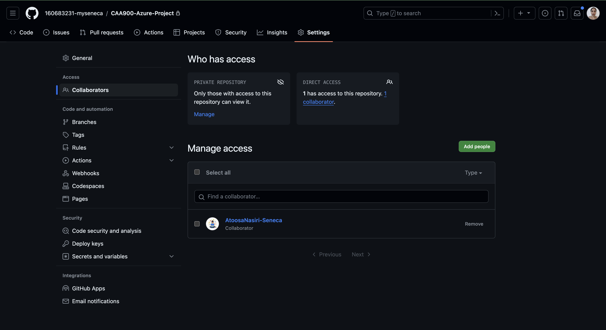

# CAA900-Azure-Project: Checkpoint1 Submission

- **COURSE INFORMATION: CAA900 - Capstone Project**
- **STUDENT’S NAME: Sanah Hussain Edavalath Vayalil Keloth**
- **STUDENT'S NUMBER: 160683231**
- **GITHUB USER_ID: 160683231-myseneca**
- **TEACHER’S NAME: Atoosa Nasiri**

## Table of Contents
- [My Collaborators Image](#my-collaborators-image)
- [Sample Single Line Code Embedding](#sample-single-line-code-embedding)
- [Sample Multi-Line Code Snippet](#sample-multi-line-code-snippet)
- [Sample JSON Object](#sample-json-object)
- [Sample Table](#sample-table)
- [Collaboration in GitHub - Suggestions](#collaboration-in-github---suggestions)
- [Useful Links](#useful-links)

## My Collaborators Image


## Sample Single Line Code Embedding
To retrieve the email address of the Azure account, you can use the following Azure CLI command:
`az account show --query user.name -o tsv`

## Sample Multi-Line Code Snippet
```bash
# Azure CLI Script to Check and Create a Resource Group if it Doesn't Exist
if [ $(az group exists --name myResourceGroup) = false ]; then 
   az group create --name myResourceGroup --location eastus
else
   echo "myResourceGroup already exists"
fi
```

## Sample JSON Object

```JSON
{
  "environmentName": "AzureCloud",
  "homeTenantId": "2c8d1a65-7f21-4b6d-98e6-9b0fba50a8e7",
  "id": "6f8b3e92-41c7-4eaa-9a6d-8c4a12f36d57",
  "isDefault": true,
  "managedByTenants": [],
  "name": "Azure for Students",
  "state": "Enabled",
  "tenantId": "2c8d1a65-7f21-4b6d-98e6-9b0fba50a8e7",
  "user": {
    "name": "shedavalath-vayalil@myseneca.ca",
    "type": "user"
  }
}
```

## Sample Table

| EnvironmentName | HomeTenantId                          | IsDefault | Name                | State   | TenantId                            |
| --------------- | ------------------------------------ | --------- | ------------------- | ------- | ----------------------------------- |
| AzureCloud      | 6f8b3e92-41c7-4eaa-9a6d-8c4a12f36d57 | True      | Azure for Students  | Enabled | 6f8b3e92-41c7-4eaa-9a6d-8c4a12f36d57 |

## Collaboration in GitHub - Suggestions

## Useful Links
- [Azure CLI with Bash Documentation](https://learn.microsoft.com/en-us/cli/azure/azure-cli-learn-bash#starting-bash): Microsoft Azure CLI documentation for using Azure CLI with Bash, making it easy to manage Azure services from the command line.

